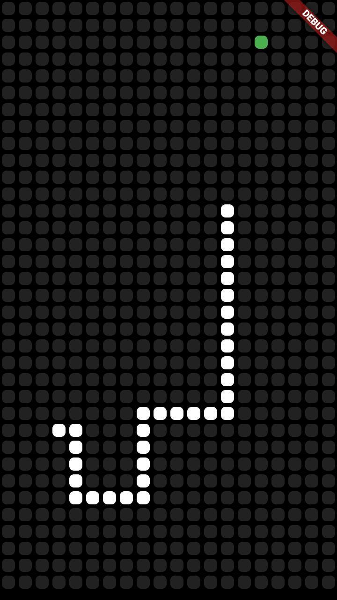
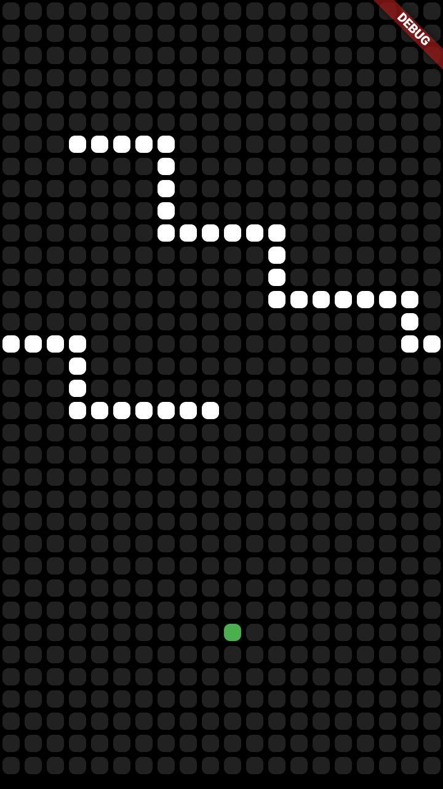

# S-s-snake

## Simple _IOS_ / _Android_ classic 2D snake game

## Description
**Snake** is a video game that _originated_ during the late 1970s in arcades becoming something of a **classic**. It became the standard pre-loaded game on _Nokia phones_ in 1998.

## Gameplay
Player controls **snake moving** direction with gestures like **swiping**.

The goal is to eat as many apples as possible. For eating apples player gets some points and snake grows up.

Also snake can goes through the walls

